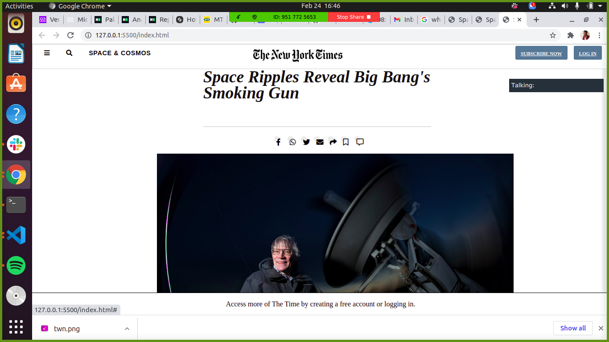

# newyorktime

 

# Project 1: Positioning and Floating Elements
New York Times Article Clone

Overview
A New York Times article clone built using only HTML5 and CSS3 as part of The Odin Project Challenge. Displaying the use of FlexBox, Grid etc. It is a responsive website and can be viewed live at visit the siteThis project is a replicate version of a New York Times article using HTML/CSS.

# Main Focus
Positioning Element
Floats and Position
UX and Forms

## LIVE DEMO

[Live Demo Link](https://verissimohenry.github.io/newyorktime/
nyt-article)

## Authors

👤 **Author1**

- GitHub: [@githubhandle](https://github.com/verissimohenry)
- Twitter: [@twitterhandle](https://twitter.com/verissimohenry)
- LinkedIn: [LinkedIn](https://linkedin.com/verissimohenry)

## 🤝 Contributing

Contributions, issues, and feature requests are welcome!

Feel free to check the [issues page](issues/https://github.com/verissimohenry/newyorktime/pull/11).

## Show your support

Give a ⭐️ if you like this project!

# Acknowledgement
Project inspiration from The Odin Project.

## 📝 License

This project is [MIT](lic.url) licensed.
